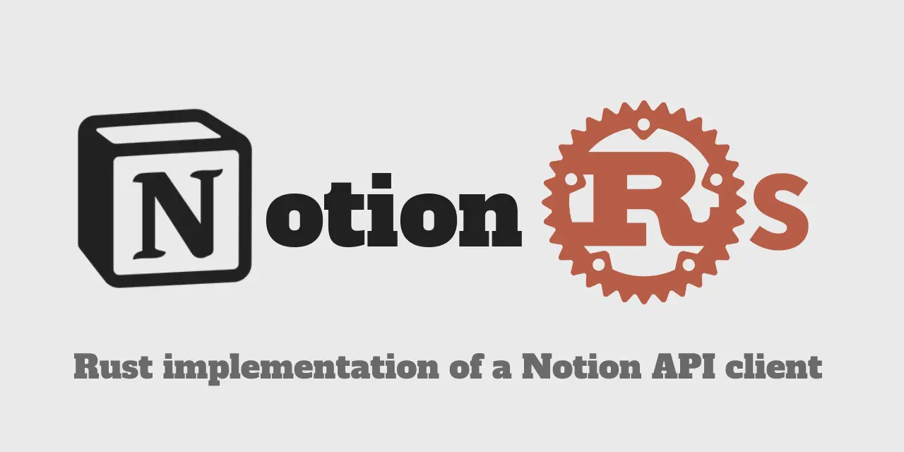

# Cliente de la API de Notion para Rust

[msrv]: https://img.shields.io/crates/msrv/notionrs

[![msrv]](https://blog.rust-lang.org/2025/02/20/Rust-1.85.0/)
[](https://github.com/46ki75/notionrs/actions/workflows/test.yml)
[](https://crates.io/crates/notionrs/)



`notionrs` ahora es compatible con `Notion-Version: 2026-03-11`.

Este proyecto se encuentra actualmente bajo desarrollo activo y aún no está listo para su uso en producción. Las características y la estabilidad de la API pueden cambiar sin previo aviso. ¡Las contribuciones y comentarios son bienvenidos!

- [♻ Notas de Versión](https://github.com/46ki75/notionrs/releases)
- [🛠️ Referencia de la API (docs.rs)](https://docs.rs/notionrs/latest/notionrs/)

> [!NOTE]
> `AGENTS.md` está escrito para agentes de IA y colaboradores internos, no para los usuarios del crate. Si estás consumiendo este crate, consulta la Referencia de la API anterior.

## Características publicadas actualmente

Como parte del lanzamiento alfa, las siguientes características están disponibles. Ten en cuenta que pueden ocurrir cambios en la API antes del lanzamiento oficial.

- Bloques
  - [Añadir hijos a un bloque](https://developers.notion.com/reference/patch-block-children)
  - [Recuperar un bloque](https://developers.notion.com/reference/retrieve-a-block)
  - [Recuperar hijos de un bloque](https://developers.notion.com/reference/get-block-children)
  - [Actualizar un bloque](https://developers.notion.com/reference/update-a-block)
  - [Eliminar un bloque](https://developers.notion.com/reference/delete-a-block)
- Bases de Datos
  - [Crear una base de datos](https://developers.notion.com/reference/create-a-database)
  - [Actualizar una base de datos](https://developers.notion.com/reference/update-a-database)
  - [Recuperar una base de datos](https://developers.notion.com/reference/retrieve-a-database)
- Fuentes de Datos
  - [Crear una fuente de datos](https://developers.notion.com/reference/create-a-data-source)
  - [Actualizar una fuente de datos](https://developers.notion.com/reference/update-a-data-source)
  - [Recuperar una fuente de datos](https://developers.notion.com/reference/retrieve-a-data-source)
  - [Consultar una fuente de datos](https://developers.notion.com/reference/query-a-data-source)
  - [Listar plantillas de fuentes de datos](https://developers.notion.com/reference/list-data-source-templates)
- Páginas
  - [Crear una página](https://developers.notion.com/reference/post-page)
  - [Recuperar una página](https://developers.notion.com/reference/retrieve-a-page)
  - [Recuperar un elemento de propiedad de página](https://developers.notion.com/reference/retrieve-a-page-property)
  - [Actualizar propiedades de página](https://developers.notion.com/reference/patch-page)
  - [Mover una página](https://developers.notion.com/reference/move-page)
  - [Recuperar página como Markdown](https://developers.notion.com/reference/retrieve-page-markdown)
  - [Actualizar página vía Markdown](https://developers.notion.com/reference/update-page-markdown)
- Vistas
  - [Crear una vista](https://developers.notion.com/reference/create-view)
  - [Recuperar una vista](https://developers.notion.com/reference/retrieve-a-view)
  - [Actualizar una vista](https://developers.notion.com/reference/update-a-view)
  - [Eliminar una vista](https://developers.notion.com/reference/delete-view)
  - [Listar vistas](https://developers.notion.com/reference/list-views)
  - [Crear una consulta de vista](https://developers.notion.com/reference/create-view-query)
  - [Obtener resultados de consulta de vista](https://developers.notion.com/reference/get-view-query-results)
  - [Eliminar una consulta de vista](https://developers.notion.com/reference/delete-view-query)
- Carga de Archivos
  - [Crear una carga de archivo](https://developers.notion.com/reference/create-file)
  - [Enviar una carga de archivo](https://developers.notion.com/reference/upload-file)
  - [Completar una carga de archivo](https://developers.notion.com/reference/complete-file-upload)
  - [Recuperar una carga de archivo](https://developers.notion.com/reference/retrieve-file-upload)
  - [Listar cargas de archivos](https://developers.notion.com/reference/list-file-uploads)
- Usuarios
  - [Listar todos los usuarios](https://developers.notion.com/reference/get-users)
  - [Recuperar un usuario](https://developers.notion.com/reference/get-user)
  - [Recuperar el usuario bot de tu token](https://developers.notion.com/reference/get-self)
  - [Listar emojis personalizados](https://developers.notion.com/reference/list-custom-emojis)
- Tareas Asíncronas
  - [Recuperar una tarea asíncrona](https://developers.notion.com/reference/retrieve-an-async-task)
- Comentarios
  - [Crear comentario](https://developers.notion.com/reference/create-a-comment)
  - [Recuperar comentarios](https://developers.notion.com/reference/list-comments)
- Búsqueda
  - [Buscar por título](https://developers.notion.com/reference/post-search)
  - [Buscar bases de datos](https://developers.notion.com/reference/post-search)
  - [Buscar páginas](https://developers.notion.com/reference/post-search)

## Uso Básico

A continuación se presenta un ejemplo básico.

`Cargo.toml`:

```toml
notionrs = { version = "0" }
notionrs_types = { version = "0" }
tokio = { version = "1", features = ["full"] }
serde = { version = "1", features = ["derive"] }
```

`src/main.rs`:

```rs
use notionrs::Client;
use notionrs_types::prelude::*;
use serde::{Deserialize, Serialize};

#[tokio::main]
async fn main() -> Result<(), Box<dyn std::error::Error>> {
    let notion_api_key = std::env::var("NOTION_API_KEY").unwrap();
    let client = Client::new(notion_api_key);

    let filter = Filter::timestamp_past_month();

    let sort = Sort::desc("Created Time");

    let request = client
        .query_data_source()
        .data_source_id("DATA_SOURCE_ID")
        .filter(filter)
        .sorts(vec![sort]);

    #[derive(Debug, Clone, Serialize, Deserialize)]
    struct MyProperties {
        #[serde(rename = "My Title")]
        pub title: PageTitleProperty,
    }

    let response = request.send::<MyProperties>().await?;

    for page in response.results {
        println!("{}", page.properties.title.to_string());
    }

    Ok(())
}
```
