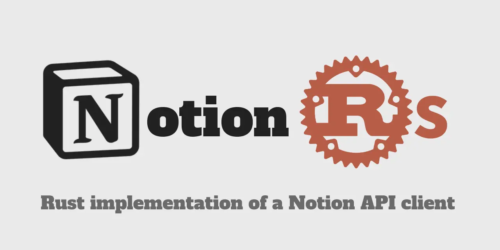

# Notion API Client for Rust

[](https://github.com/46ki75/notionrs/actions/workflows/unit-tests.yml)
[](https://github.com/46ki75/notionrs/actions/workflows/build-documentation.yml)
[](https://crates.io/crates/notionrs/)



**Status: Alpha Release! (Under Construction**) 🚧

This project is currently under active development and is not yet ready for production use. Features and API stability may change without notice. Contributions and feedback are welcome!

- [♻ Release Notes](https://github.com/46ki75/notionrs/releases)
- [💡 User Guide | Documentation](https://46ki75.github.io/notionrs/) (Under Construction)
- [🛠️ API Reference (docs.rs)](https://docs.rs/notionrs/latest/notionrs/)

## Features currently released

As part of the alpha release, the following features are available. Please note that API changes may occur before the official release.

- Blocks
  - Append block children
  - Retrieve a block
  - Retrieve block children
  - Update a block
  - Delete a block
- Databases
  - Create a database
  - Query a database
  - Retrieve a database
  - Update a database
- Pages
  - Create a page
  - Retrieve a page property item
  - Retrieve a page
  - Update page properties
- Users
  - List all users
  - Retrieve a user
  - Retrieve your token's bot user
- Comments
  - Create comment
  - Retrieve comments
- Search
  - Search by title

## Basic Usage

Below is a basic example. (More detailed documentation is coming soon, so please stay tuned!)

```rs
use notionrs_schema::prelude::*;
use notionrs::{Client, Error};

#[tokio::main]
async fn main() -> Result<(), Error> {
    let client = Client::new().secret("API_KEY");

    let rich_text = RichText::from("rich text");

    let block = Block::Paragraph {
        paragraph: ParagraphBlock::default()
            .rich_text(vec![rich_text.clone()])
            .blue_background(),
    };

    let request = client
        .append_block_children()
        .block_id("PARENT_BLOCK_ID")
        .children(vec![block]);

    let response = request.send().await?;

    println!("{:?}", response);

    Ok(())
}
```
