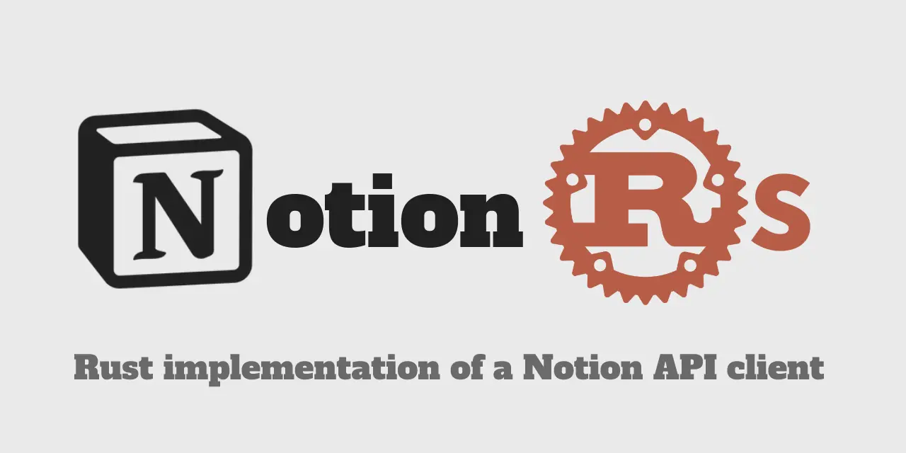

# Notion API Client for Rust

[msrv]: https://img.shields.io/crates/msrv/notionrs

[![msrv]](https://blog.rust-lang.org/2025/02/20/Rust-1.85.0/)
[](https://github.com/46ki75/notionrs/actions/workflows/test.yml)
[](https://crates.io/crates/notionrs/)



`notionrs` now supports `Notion-Version: 2026-03-11`.

This project is currently under active development and is not yet ready for production use. Features and API stability may change without notice. Contributions and feedback are welcome!

- [♻ Release Notes](https://github.com/46ki75/notionrs/releases)
- [🛠️ API Reference (docs.rs)](https://docs.rs/notionrs/latest/notionrs/)

> [!NOTE]
> `AGENTS.md` is written for AI agents and internal contributors, not for crate users. If you're consuming this crate, see the API Reference above.

## Features currently released

As part of the alpha release, the following features are available. Please note that API changes may occur before the official release.

- Blocks
  - [Append block children](https://developers.notion.com/reference/patch-block-children)
  - [Retrieve a block](https://developers.notion.com/reference/retrieve-a-block)
  - [Retrieve block children](https://developers.notion.com/reference/get-block-children)
  - [Update a block](https://developers.notion.com/reference/update-a-block)
  - [Delete a block](https://developers.notion.com/reference/delete-a-block)
- Databases
  - [Create a database](https://developers.notion.com/reference/create-a-database)
  - [Update a database](https://developers.notion.com/reference/update-a-database)
  - [Retrieve a database](https://developers.notion.com/reference/retrieve-a-database)
- Data sources
  - [Create a data source](https://developers.notion.com/reference/create-a-data-source)
  - [Update a data source](https://developers.notion.com/reference/update-a-data-source)
  - [Retrieve a data source](https://developers.notion.com/reference/retrieve-a-data-source)
  - [Query a data source](https://developers.notion.com/reference/query-a-data-source)
  - [List data source templates](https://developers.notion.com/reference/list-data-source-templates)
- Pages
  - [Create a page](https://developers.notion.com/reference/post-page)
  - [Retrieve a page](https://developers.notion.com/reference/retrieve-a-page)
  - [Retrieve a page property item](https://developers.notion.com/reference/retrieve-a-page-property)
  - [Update page properties](https://developers.notion.com/reference/patch-page)
  - [Move a page](https://developers.notion.com/reference/move-page)
  - [Retrieve page as Markdown](https://developers.notion.com/reference/retrieve-page-markdown)
  - [Update page via Markdown](https://developers.notion.com/reference/update-page-markdown)
- Views
  - [Create a view](https://developers.notion.com/reference/create-view)
  - [Retrieve a view](https://developers.notion.com/reference/retrieve-a-view)
  - [Update a view](https://developers.notion.com/reference/update-a-view)
  - [Delete a view](https://developers.notion.com/reference/delete-view)
  - [List views](https://developers.notion.com/reference/list-views)
  - [Create a view query](https://developers.notion.com/reference/create-view-query)
  - [Get view query results](https://developers.notion.com/reference/get-view-query-results)
  - [Delete a view query](https://developers.notion.com/reference/delete-view-query)
- File Uploads
  - [Create a file upload](https://developers.notion.com/reference/create-file)
  - [Send a file upload](https://developers.notion.com/reference/upload-file)
  - [Complete a file upload](https://developers.notion.com/reference/complete-file-upload)
  - [Retrieve a file upload](https://developers.notion.com/reference/retrieve-file-upload)
  - [List file uploads](https://developers.notion.com/reference/list-file-uploads)
- Users
  - [List all users](https://developers.notion.com/reference/get-users)
  - [Retrieve a user](https://developers.notion.com/reference/get-user)
  - [Retrieve your token's bot user](https://developers.notion.com/reference/get-self)
  - [List custom emojis](https://developers.notion.com/reference/list-custom-emojis)
- Comments
  - [Create comment](https://developers.notion.com/reference/create-a-comment)
  - [Retrieve comments](https://developers.notion.com/reference/list-comments)
- Search
  - [Search by title](https://developers.notion.com/reference/post-search)
  - [Search databases](https://developers.notion.com/reference/post-search)
  - [Search pages](https://developers.notion.com/reference/post-search)

## Basic Usage

Below is a basic example.

`Cargo.toml`:

```toml
notionrs = { version = "0" }
notionrs_types = { version = "0" }
tokio = { version = "1", features = ["full"] }
serde = { version = "1", features = ["derive"] }
```

`src/main.rs`:

```rs
use notionrs::Client;
use notionrs_types::prelude::*;
use serde::{Deserialize, Serialize};

#[tokio::main]
async fn main() -> Result<(), Box<dyn std::error::Error>> {
    let notion_api_key = std::env::var("NOTION_API_KEY").unwrap();
    let client = Client::new(notion_api_key);

    let filter = Filter::timestamp_past_month();

    let sort = Sort::desc("Created Time");

    let request = client
        .query_data_source()
        .data_source_id("DATA_SOURCE_ID")
        .filter(filter)
        .sorts(vec![sort]);

    #[derive(Debug, Clone, Serialize, Deserialize)]
    struct MyProperties {
        #[serde(rename = "My Title")]
        pub title: PageTitleProperty,
    }

    let response = request.send::<MyProperties>().await?;

    for page in response.results {
        println!("{}", page.properties.title.to_string());
    }

    Ok(())
}
```
